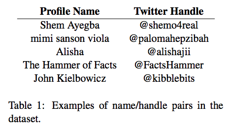
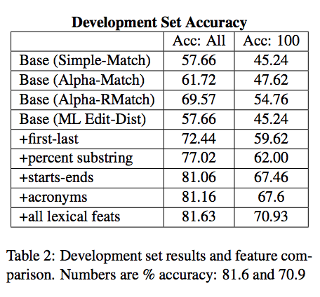
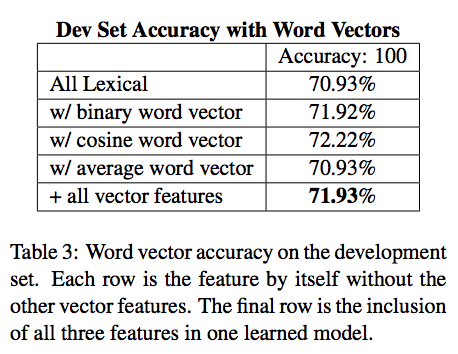
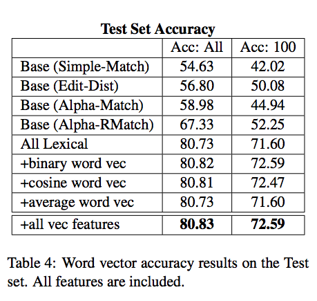
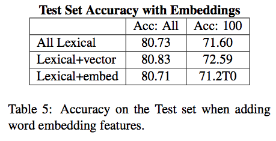
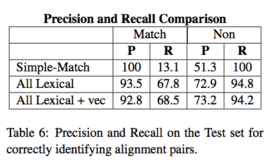
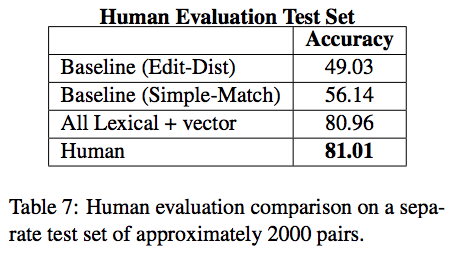
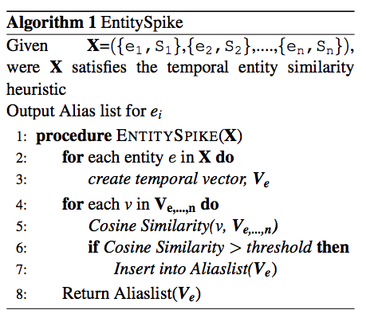
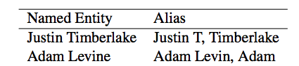

```{r setup, include=FALSE}
options(htmltools.dir.version = FALSE)
```

# Outline

* Motivation

* Datasets

* Features
    * Lexicographic Features
    * Semantic Features
    
* Negative Sampling

* Modeling

* Results

* Error Analysis

* Our Cases

* References

---

# Motivation
--

- Questions

  * Can aliases be aligned without backgroud knowledge?

  * Can semantics surrounding alias mentions be used to inform alignments?

  * How to resolve mentions of a user's online alias and mentions of a named entity?

  Examples: `The King`, `King James` -> `Lebron James`

--

- Goal: if an entity name and an alias are likely to refer to the same real-world entity or not.

--

- Applications

  * sentimental analysis

  * user profiling

  * event detection

---

# Datasets

$P^+$: 110k tweets

$P^-$: 110k tweets by randomly sampling

Corpus-based features based on "one-year tweet corpus"

<center>



<center>

---

# Lexicographic Features

--

- Edit Distance

    * lowercase first, white space included
    
--

- Exact Match

    * white space removed
    
--

- First and Last Name

    * if alias starts with first name of entity -> length of first name
    * if alias ends with last name of entity -> length of last name
    * if entity name appears in whole anywhere in the alias 
        * `John Williams` in `@JohnWilliams2`
        
--

- Percent Substring

    * the number of overlapping characters between name and alias

---

# Lexicographic Features

--

- Starts and Ends With

    * count of longest shared prefix
    * count of longest share suffix

--

- Capital Substring

    * the number of substrings that are contained within the name

--

- Acronyms

    * if the alias is an acronym of the lowercased name's tokens
    * the number of overlapping capital-acronym feature in alias and name

--

- Exact Capitalization

    * if the capital letters of a name are identical to those of a alias
--

- Reverse Substring

    * if the alias is the name in reverse, or vice-versa
        * `Janey` and `@yenaj`

---

# Semantic Features

--

- Count Vector 

- Embedding Vector

--

    * cosine similarity
    
    * cosine similarity > threshold
    
    * averaged-consine similarity
    
    $$f(n, a) = \frac{cos(n, a)*N}{\sum_{x}cos(n, x)}-1$$
    
---

# Negative Sampling

Choosing $<n^i, n^j,0>$ from

$$n^j = \text{argmax}_{i \neq j} \space g(n^j, n^i), \forall n^i \in \text{Entity Space}$$
--

- Random Sampling

--

- Corrupting positive instances

--

- Typed Sampling

--

- Relational Sampling

--

- Nearest Neighbor Sampling

--

- Near Miss Sampling

--

---

# Modeling

--

- Models

    * SVM
    * MaxEntropy Classifier
    
- Baseline

    * Simple-Match
    * Alpha-Match
    * Alpha-RelaxMatch
    * ML Edit-Dist

--

- Evaluation Metric

    * Accuracy 
        * Accuracy: all
        * Accuracy: 100
    
    $$\frac{\text{#correct}}{N}$$


---

# Results

--

<center>



<center>

---

# Results

--

<center>



<center>

---

# Results

--

<center>



<center>

---

# Results

--

<center>



<center>

---

# Results

--

<center>



<center>

---

# Results

--

<center>



<center>

---

# Error Analysis

--

- Why is accuracy for high frequency entities lower?

    * High frequency entities have less similarity in their twetter handles.
--

- Do count vectors actually help?

    * 1.4% relative improvement on test
    * Statistically significant using McNemar's test

---

# Other Ideas - EntitySpike

<center>


--


<center>

---

# Our Cases

$P_{+}=\{<n^i, n^j,1>|(\forall n_l^i, n_l^j \in e_l) \wedge (\forall e_l \in R)\}$

$P_{\_}=\{<n^i, n^j,0>|(n_l^i, n_m^j \in e_l, e_m) \wedge (e_l, e_m \in R) \wedge (e_l \neq e_m)\}$

$n^i$: skill name or alias

$e^i$: entity id

Example: < `machine learning`, `statistical learning` \>

- Goals

    * Detect bad < skill, alias \> pairs
    * Expand taxonomy using external sources such as Wiki data
  
--

- Negative Sampling

--

- Feature Engineering ([paragram_300_sl999](https://cogcomp.org/page/resource_view/106))

--

- Modeling (**[BERT](https://arxiv.org/abs/1810.04805)** or **[A La Carte Embedding](https://arxiv.org/abs/1805.05388)** or **[NSEEN](https://arxiv.org/pdf/1811.07514.pdf)**)

---

# References

[1] [Aligning Entity Names with Online Aliases on Twitter](http://www.aclweb.org/anthology/W17-1104)

[2] [From Paraphrase Database to Compositional Paraphrase Model and Back](http://www.aclweb.org/anthology/Q15-1025)

[3] [Analysis of the Impact of Negative Sampling on Link Prediction in Knowledge Graphs](https://arxiv.org/pdf/1708.06816.pdf)

[4] [Constructing an Alias List for Named Entities during an Event](http://cis.upenn.edu/~ccb/publications/constructing-an-alias-list.pdf)

[5] [NSEEN: Neural Semantic Embedding for Entity Normalization](https://arxiv.org/pdf/1811.07514.pdf)

[6] [BERT: Pre-training of Deep Bidirectional Transformers for Language Understanding](https://arxiv.org/abs/1810.04805)

[7] [A La Carte Embedding: Cheap but Effective Induction of Semantic Feature Vectors](https://arxiv.org/abs/1805.05388)

---

class: center, middle

# Questions ?


